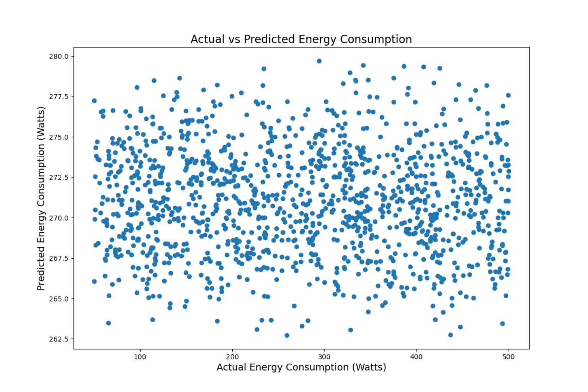
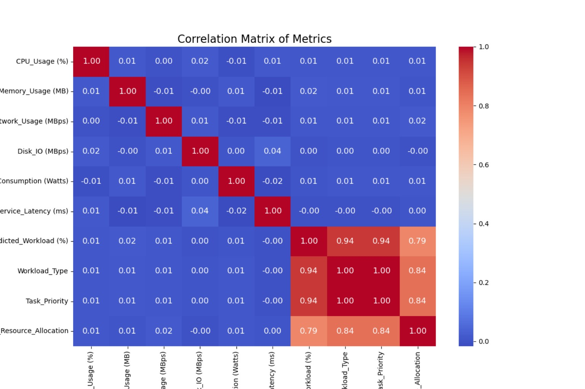
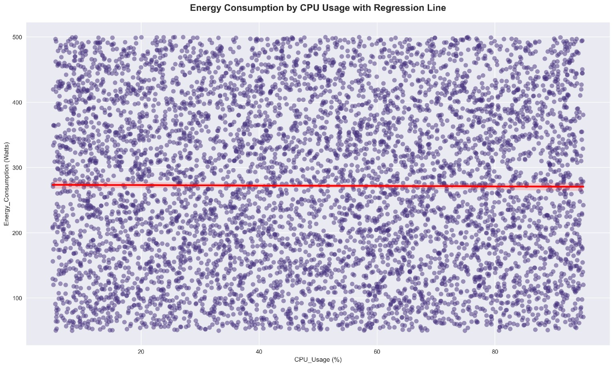
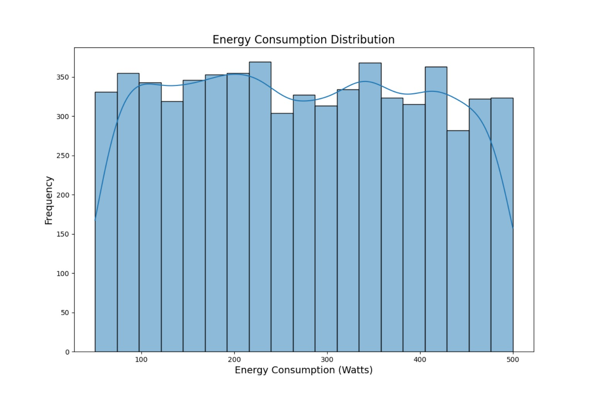
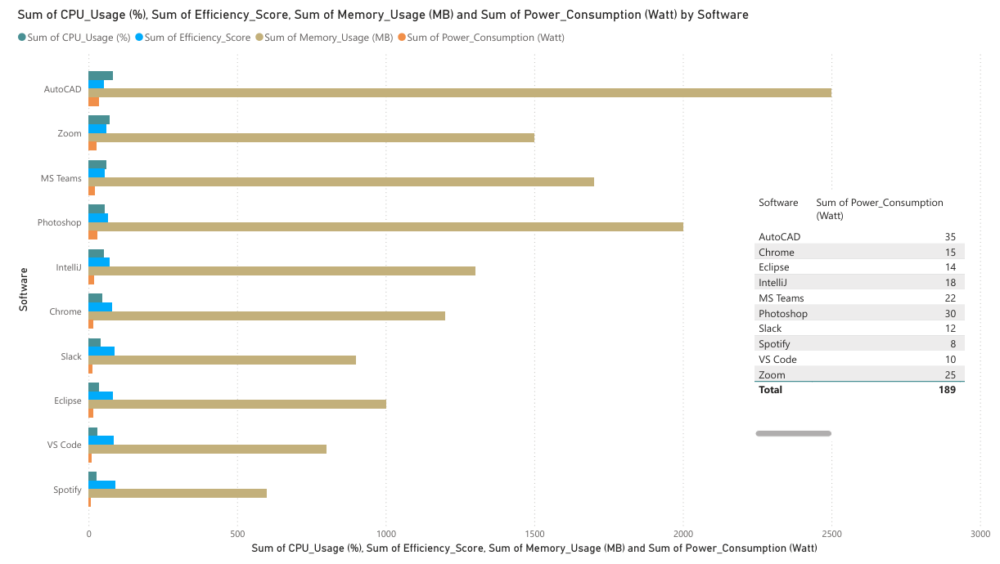

## Visual Analysis

### Actual vs Predicted Energy Consumption

The scatter plot shows a weak alignment between predicted and actual values, indicating limitations in relying on simple models for energy prediction.

---

### Correlation Matrix

The correlation analysis reveals weak relationships between individual system metrics and energy consumption, suggesting that energy behavior is influenced by multiple combined factors.

---

### CPU vs Energy Consumption

The regression line demonstrates that CPU usage alone is not a strong predictor of energy consumption, challenging common assumptions in performance optimization.

---

### Energy Consumption Distribution

The distribution shows variability in energy consumption, highlighting the dynamic nature of software resource usage.

---

### Power BI Dashboard

An interactive dashboard was developed to compare energy consumption across different software applications.

Full dashboard available here:
[View Full Dashboard](dashboard.pdf)
